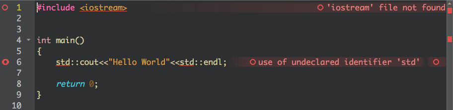

# OpenMP on OSX (High Sirerra and above )

## Setting Up Dev Env for Command Line Use

***Step 0***: Make sure `brew` is installed and ready to go

***Step 1***: install `llvm` 

`$ brew install llvm`

***Step 2***: install `libomp`

`$ brew install libomp`

***Step 3***: Run a test code using the following explicit calls and flags

`$ /usr/local/opt/llvm/bin/clang++ -fopenmp <YOURCODE>.cpp -L/usr/local/opt/llvm/lib -I/usr/local/opt/llvm/include -o <execName> `

example code to run :
```` C++
#include <omp.h>
#include <iostream>
using namespace std;
int main( int argc, char ** argv )
{
omp_set_num_threads(10);
cout << "OpenMP - Max number of threads : " << omp_get_max_threads() << endl;
#pragma omp parallel
//   cout <<"Hello World"<<endl;
cout<<"Hello World  my name is thread  "<<omp_get_thread_num()<< endl;
return 0;
}
````
if you save as `hello_world.cpp`, you can run :

`$ /usr/local/opt/llvm/bin/clang++ -fopenmp hello_world.cpp -L/usr/local/opt/llvm/lib -I/usr/local/opt/llvm/include -o hello`

*n.b. : make sure no errors are generated* 

***Step 4***: Run the executable

`$ ./hello`

*n.b.: make sure your output makes sense*

***Step 5*** (optional): Make an alias for the compiler call (i.e. `/usr/local/opt/llvm/bin/clang++`) and the include flags for easier compilation

## Setting Up QT Dev Env with OpenMP on macOS

Disclaimer: I would like to note that in my humble opinion, QT creator is one of the worst IDEs I have ever used (and I have not used that many); I think most developers would agree with the following:

1. Try using command line for writing and compiling your code 
1. If you are using a macOS, use Xcode

But due to popular demand, here are the steps of how to set up QT to work with openMP in OSX.

***Step 1***: Disable Clang Code Model to Reduce Annoyance
Since we are changing the default compilers, we will get a lot of IDE errors when writing the code, but these are not *real errors* since your code will compile and run just fine. The idea is that a QT plugin called "Clang Code Model" uses a desktop compiler to parse the code, but we are doing some cross compiler stuff. Althought this will not result in any crashes, it is very annoying to see a bunch of errors that should not be there. For example, we can get the following editor errors (note the red circle with black centers and not red centers!):


To disable this got to **QT Creator > About Plugins** and uncheck **Clang Code Model** (under **C++** tab). Here is GIF to better illustrate this process:


*n.b. make sure to exit out of QT, and reopen after this step.*

***Step 2***: Add the New Compilers to QT
Now that we have installed the compilers, we want to make sure that QT finds them. This can be done via **(Side Pannel) Projects > Kits > Compilers**.

Once you are in the compiler tab, click on **add > Clang > C++** and enter the following:  

Name: `AlisLLVM_C++(ANY NAME WORKS)`
Compiler Path: `/usr/local/opt/llvm/bin/clang++`

and leave the rest as default. You should also do the same thing for a `C` compiler, in case if you need to run a C program in the future. In the Compiler tab, you can do **add > Clang > C** and enter:

Name: `AlisLLVM_C`
Compiler Path: `/usr/local/opt/llvm/bin/clang`

*n.b. make sure that these new compilers show up under manual drop-down menue of the compiler list*


Just to illustrate how these should look like after you have done the above steps:


***Step 2***: Change the Kit's Compiler to the New Compilers
The last setup step is to change the compilers of the kit from the default to the new ones that we just added. To do so, go to **(Side Pannel) Projects > Kits** and select the current kit which you are using. In the menu, change the Compiler for `C` and `C++` to the ones you just added. The following GIF demonstrates how that would be done if the compilers were named `OpenMP_LLVM_C++` and `OpenMP_LLVM_C` respectively.


***Step 3***: Add `make` Flags to `.pro`
Finally, we can add the following flags to the `.pro` file of your project, and it should work like a charm!

````
macx: 
{
QMAKE_CXXFLAGS += -Xpreprocessor -fopenmp -lomp -I/usr/local/include
}
macx: 
{
QMAKE_LFLAGS += -lomp
}

macx: 
{
LIBS += -L /usr/local/lib /usr/local/lib/libomp.dylib
}
````

***Step 4***: Run Your Code and Ponder Why You Use QT when You have Xcode

That's it, everything should work just fine now. For demonstration, I will run the following code with 20 threads:

````C++
#include <iostream>
#include <omp.h>

int main()
{
std::cout <<"Hello World Non-openMP"<<std::endl;
std::cout <<"----------------------"<<std::endl;
omp_set_num_threads(20);
std::cout << "OpenMP - Max number of threads : " << omp_get_max_threads() << std::endl;
std::cout <<"----------------------"<<std::endl;
#pragma omp parallel
std::cout<<"Hello World  my name is thread  "<<omp_get_thread_num()<< std::endl;
return 0;
}
````

and we get the following output:


--------

Hope this has been helpful. Please let me know if you have any questions or concerns. 

